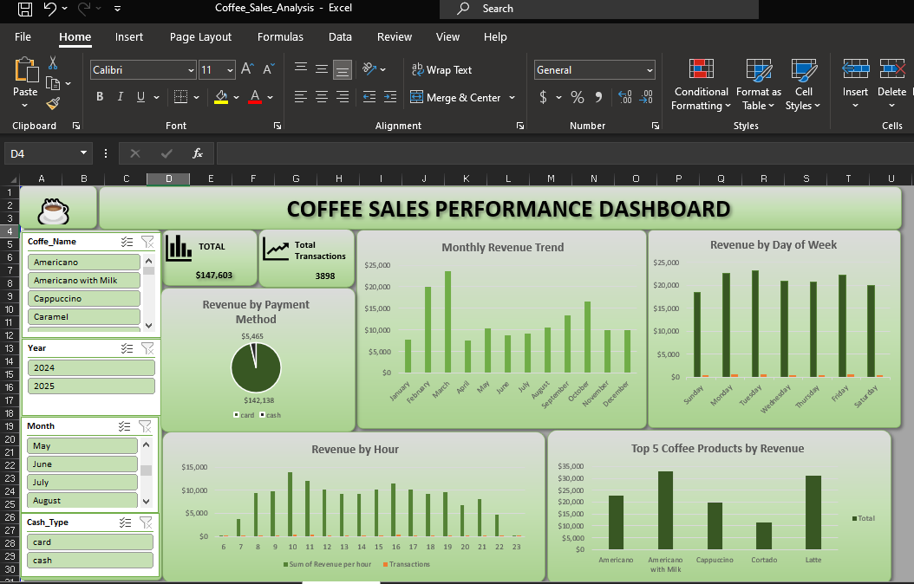

# ☕ Coffee Sales Analysis — Excel Dashboard

##  Project Overview

This project analyzes coffee shop sales data using Microsoft Excel.

The goal was to clean, transform, analyze, and visualize sales data to identify important business trends and provide useful insights for decision-making.

The dataset contains 3,898 transactions.

## 🛠️ Tools & Techniques

- Microsoft Excel
- Data Cleaning
- Excel Formulas
- PivotTables
- Pivot Charts
- Slicers
- Conditional Formatting
- Exploratory Data Analysis
- Dashboard Design

## 📊 Key Areas of Analysis

The analysis covers:

- Overall sales performance
- Monthly revenue trends
- Revenue by day of week
- Revenue by hour
- Product performance
- Payment method analysis
- Customer purchasing behavior
- Repeat customer analysis
- Product revenue concentration
- Product performance by time of day

## 📈 Dashboard

## 💰 Key KPIs

| KPI | Value |
|---|---:|
| Total Revenue | $147,603 |
| Total Transactions | 3,898 |
| Average Transaction Value | $37.87 |

## 💡 Business Questions

This project answers questions such as:

1. Which coffee products generate the most revenue?
2. Which products are purchased most frequently?
3. Which months generate the highest revenue?
4. Which days of the week perform best?
5. What are the busiest hours?
6. Which payment method is most commonly used?
7. How important are repeat customers?
8. Which products contribute most to total revenue?

##  Business Value

The analysis can help support decisions around:

- Inventory planning
- Staff scheduling
- Product prioritization
- Promotional planning
- Customer retention
- Payment system planning

## 📁 Project Files

- `Coffee_Sales_Analysis.xlsx` — Complete Excel analysis and interactive dashboard
- `dashboard.png` — Screenshot of the final dashboard

## 👤 Author

Joshua Obisi

Aspiring Data Analyst
